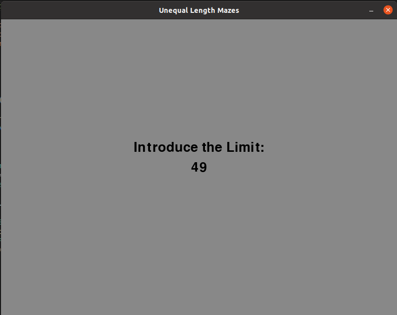

# Unequal Length Mazes

> O jogo **Unequal Length Mazes** consiste num tabuleiro de dimensões arbitrárias com algumas das suas células bloqueadas (obstáculos). O objetivo do jogo é encontrar um caminho desde a célula inferior esquerda até à célula superior direita que passe por todas as células disponíveis (não bloqueadas) apenas uma vez. O caminho deve alternar entre segmentos horizontais e verticais e dois segmentos consecutivos não podem ter o mesmo tamanho.

## Pré-Requisitos

De forma a conseguir correr e testar a aplicação é necessário ter instalado os seguintes *softwares*:
- [Python 3](https://www.python.org/downloads/)
- [Pygame](https://www.pygame.org/download.shtml)

## Como Correr

1. Descompactar o ficheiro `1A_05_assignment1.zip`
2. Ir para o diretório descompactado (ex.: `cd 1A_05_assignment1`)
3. Executar o ficheiro `src/main.py` (ex.: python3 `src/main.py`)

## Como Usar

Após correr o programa será aberta uma janela Pygame onde serão apresentadas as seguintes opções, selcionáveis premindo o número da opção respetiva:

- [*Choose Board*](#choose-board)
- [*Solve Puzzle by myself*](#solve-puzzle-by-myself)
- [*Solve Puzzle by AI*](#solve-puzzle-by-ai)
- [*Comparative Analysis*](#comparative-analysis)
- [*Exit*](#exit)


<br>

### Choose Board

Permite escolher o tabuleiro a jogar/cuja solução computar pela *IA* a partir de uma lista de tabuleiros disponíveis, premindo a tecla que corresponde à legenda do tabuleiro pretendido.


***NOTA:*** Por defeito, o tabuleiro selecionado no início do jogo corresponde ao tabuleiro *`a`*.

<br>

### Solve Puzzle by myself

Permite que o utilizador resolva o puzzle previamente escolhido segundo as regras do jogo. Caso necessite, o jogador pode pedir ajuda à IA que lhe dirá para que direção se deve mover para ficar mais perto de vencer o jogo. 

Por cada jogo, o jogador tem uma **pontuação** que é **incrementada a cada segundo** e **acrescida de 20s por cada ajuda pedida**. O objetivo é vencer o jogo com a menor pontuação possível!

Se o jogador concluir o tabuleiro com sucesso será apresentada a sua pontuação final e uma mensagem de vitória no canto inferior direito. 


**Como Jogar:**
- Utilizar as setas do teclado para se mover em cada uma das direções
- Utilizar a tecla de *`backspace`* se desejar retroceder no caminho percorrido
- Utilizar a tecla *`h`* para pedir uma ajuda que será mostrada no centro da parte inferior da janela
- Utilizar a tecla *`esc`* para sair do jogo (em andamento e/ou terminado)

***NOTA:*** A jogada apenas é realizada se válida, por exemplo, só permite alterar de uma direção vertical para horizontal ou vice-versa se com isso não gerar segmentos consecutivos de igual tamanho.

<br>

### Solve Puzzle by AI

Apresenta ao utilizador quais algoritmos de inteligência artificial que podem ser escolhidos para resolver o puzzle. Escolhe uma opção premindo a tecla correspondente ao número da opção pretendida.


Caso o utilizador escolha um algoritmo que permita indroduzir um limite de profundidade na árvore de pesquisa, o mesmo terá de introduzir a profundidade máxima que pretende e premir a tecla *`enter`*. Pode ainda optar por retrocer premindo a tecla *`esc`*



Caso o utilizador escolha um algoritmo que permita a utilização de heurísticas, o mesmo terá de escolher, entre as heurísticas disponíveis, qual a que pretende que seja utilizada na resolução do puzzle, premindo a tecla correspondente ao número da opção pretendida.


No final da computação será apresentado na janela a solução encontrada, bem como a informação sobre o número de nós visitados, tempo de execução e profundidade da solução. Para retroceder basta premir a tecla *`esc`*.


<br>

### Comparative Analysis

Esta opção corre os vários algoritmos para os 27 tabuleiros disponíveis e guarda a informação abaixo para cada um deles no ficheiro `analysis.csv` no seguinte formato:

```
tabuleiro, algoritmo, heurística utilizada, tempo de execução, número de nós visitados, profundidade da solução
```

***NOTA:*** Os algoritmos *Limited Depth First Search* e *Iterative Deepening* não foram incluídos nesta análise pois aumentariam significativamente o seu tempo de execução e por considerarmos que têm pouca relevância para a mesma, uma vez que o nosso problema tem uma única solução.

<br>

### Exit

Esta opção permite ao utilizador terminar o programa.